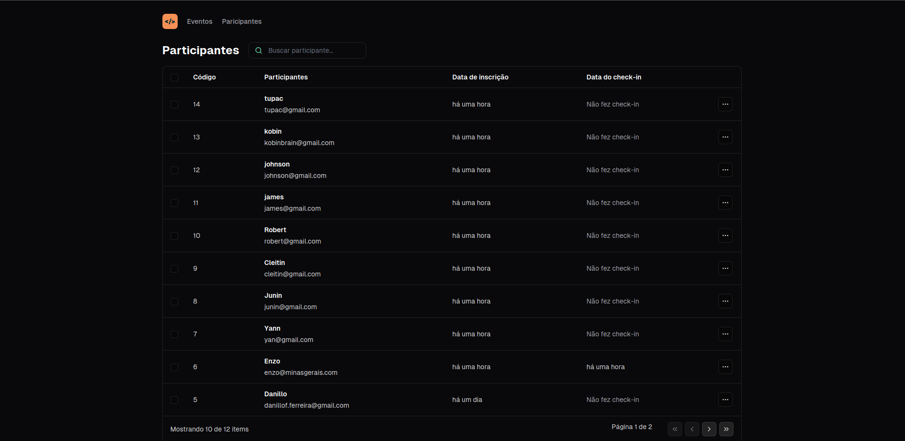

# Pass In - Dashboard para Gerenciamento de Participantes de Evento

## Descrição

Pass In é um dashboard desenvolvido para gerenciar os participantes de um evento. Ele fornece uma interface intuitiva e amigável para os organizadores do evento acompanharem o registro e participação dos indivíduos.

Este projeto foi feito em react desenvolvido durante o evento NLW Unite, organizado pela Rocketseat.

Aqui está a seção "Como Utilizar" completa, mesclando os novos pontos com os anteriores de forma organizada:

---

## Funcionalidades Principais

- Visualização de Participantes: Apresenta uma lista de todos os participantes cadastrados.
- Detalhes do Participante: Fornece informações detalhadas sobre cada participante, incluindo nome, e-mail, status de inscrição, etc.
- Pesquisa e Filtros: Facilita a busca e filtragem de participantes com base em diferentes critérios.

---

## Como Utilizar

Para começar a utilizar o Pass In, siga este guia passo a passo:

### 1. Clonando o Repositório

Clone este repositório em sua máquina local usando o seguinte comando:

```
git clone https://github.com/seu-usuario/pass-in.git
```

### 2. Clonando e Executando a API

Além do frontend, você também precisará clonar e executar a API correspondente. Clone o repositório da API usando o seguinte comando:

```
git clone https://github.com/nilloferreiira/pass-in-api.git
```

Em seguida, siga as instruções fornecidas no README da API para configurar e executar o servidor.

### 3. Gerenciando um Novo Evento

Se você criar um novo evento e desejar gerenciá-lo usando o Pass In, siga este passo a passo:

#### 3.1 Atualizando o ID do Evento

No componente `attendee-list`, você precisará atualizar o ID do evento para o novo evento que você criou. Siga estas etapas:

- Navegue até o diretório `src/components/attendee-list`.
- Abra o arquivo `attendee-list.js` em um editor de texto.
- Encontre a constante `eventId`.
- Substitua o valor de `eventId` pelo ID do novo evento que você criou.

Por exemplo:

```javascript
const eventId = 'novo-eventId';
```

### 4. Iniciando o Servidor de Desenvolvimento

Depois de clonar o repositório e configurar a API, você pode iniciar o servidor front-end do Pass In com o seguinte comando:
(lembre de voltar ao diretorio do front-end)

```
cd pass-in
npm install
npm start
```

### 5. Acessando a Aplicação

Abra o seu navegador da web e navegue até o seguinte endereço:

```
http://localhost:5173
```

Você será redirecionado para o dashboard do Pass In, onde poderá começar a gerenciar os participantes do seu evento.

### 6. Explorando Funcionalidades

Explore as diferentes funcionalidades oferecidas pelo Pass In, visualizar informações detalhadas dos participantes, gerenciar inscrições e utilizar os recursos de pesquisa e filtros.

---

Espero que este guia completo seja útil para começar a utilizar o Pass In. Se tiver alguma dúvida ou encontrar algum problema durante o processo, não hesite em entrar em contato.

email: nilloferreiira@gmail.com

